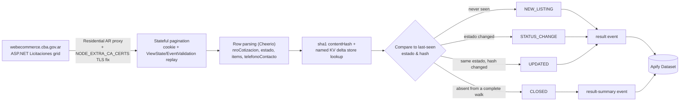

<div align="center">

# Cordoba Argentina Licitaciones - Tender Delta API

**A Cordoba, Argentina government procurement (compras públicas) monitor that turns a stateful, session-bound tenders portal into a clean, delta-aware public tenders dataset, on a schedule you configure.**

[](https://apify.com)
[](https://apify.com/stefano_seggio/cordoba-compras-monitor)
[](https://www.typescriptlang.org/)
[](https://github.com/stefanoseggio/cordoba-compras-monitor/blob/main/LICENSE)

[](https://apify.com/stefano_seggio/cordoba-compras-monitor)

Console reference (owner): [console.apify.com/actors/q9jhMgJRSGjyNbXKA](https://console.apify.com/actors/q9jhMgJRSGjyNbXKA)

</div>

---

## What it does

Checking the Province of Córdoba's official *compras públicas* portal by hand means clicking through a paginated, stateful ASP.NET grid and re-reading every row yourself to notice what changed. **Cordoba Argentina Licitaciones - Tender Delta API** does that walk programmatically and hands back a structured public tenders dataset: tender number (`nroCotizacion`), contract type, issuing organism, jurisdiction, publication and closing dates, status (`estado`), per-item reference budget, and contact phone — one record per active licitación, already parsed from the source's own listing fetch.

Where this actor earns its keep as a **public tenders API alternative** for Córdoba is delta mode. With `onlyNew` enabled, it persists which tenders it has already seen — and their last-known status and a content fingerprint — in a key-value store that survives between scheduled runs, and on every subsequent run reports only what actually changed: a brand-new listing, a status change, an amendment (a deadline extension, a revised budget), or a closure. That is the difference between a one-off scrape and a Córdoba government procurement monitor a contractor, gestor, or market-research team can put on a schedule and trust to flag changes on its own.

The scope is deliberately exact: this actor covers the active *Licitaciones* register published by `webecommerce.cba.gov.ar`, nothing broader and nothing historical. Awarded or archived tenders are out of scope, by design, because the source itself does not expose them through this portal.

## Who uses this

- **Contractors and suppliers bidding on Córdoba public works and services** — pull the active register and use `tipoContratacion` and `servicioAdministrativo` on each record to spot the tenders that match what they sell and who's buying, with `prorroga` and `STATUS_CHANGE` flagging a tracked deadline extension without refreshing the portal.
- **Market-entry research teams evaluating the Córdoba public sector** — a full run (`onlyNew: false`) surfaces which agencies are actively procuring, and at what reference budget, via `servicioAdministrativo`, `jurisdiccion`, and `items[].presupuestoOficial`.
- **Procurement consultants and *gestores* tracking several clients' tenders at once** — a scheduled run with `onlyNew: true` returns only `NEW_LISTING`, `STATUS_CHANGE`, `UPDATED`, or `CLOSED` across every tracked `nroCotizacion`, instead of manually re-checking each client's tenders one by one.

## Cost & BYOK Disclosure

**Pricing model:** pay per event, platform usage included — there is no separate compute charge on top.

| Event | What triggers it | Price |
| --- | --- | --- |
| `result` | A tender is delivered as `NEW_LISTING`, `STATUS_CHANGE`, or `UPDATED` — full tender content | Pay-per-result — see the [live Store pricing tab](https://apify.com/stefano_seggio/cordoba-compras-monitor) for the current exact rate |
| `result-summary` | A tender is delivered as `CLOSED` — a derived absence signal, nothing fresh to fetch | Pay-per-result — see the live Store pricing tab for the current exact rate |
| Actor start | Once per run, regardless of how many tenders are returned | See the live Store pricing tab for the current exact rate |

Specific per-event rates have appeared in this Actor's own Store listing and in earlier README revisions; the Store's **Pricing** tab is the single, always-current source of truth, so it's linked above rather than a number restated here that could drift out of date. Recurring monitoring with `onlyNew: true` costs less per run by construction: it only ever delivers what actually changed since the last run, instead of billing `result` for every unchanged tender in the register every time.

**Delta suppression, never a refund.** A tender whose `estado` and content fingerprint both match what was already delivered is classified `UNCHANGED` and is never pushed to the dataset — the fingerprint comparison against the persisted key-value store happens *before* delivery on every run, so an unchanged tender is simply never billed, not refunded after the fact.

**BYOK:** This Actor requires no third-party API key. It does require a **Residential + Argentina** Apify Proxy group (defaulted automatically even if `proxyConfiguration` is omitted) because the source blocks non-residential, non-Argentina traffic — that proxy is billed through your own Apify platform usage, not a separate third-party key you supply.

## How it works



## Features

| Feature | Description |
| --- | --- |
| **Delta mode (`onlyNew`)** | Persists seen tender ids, their `estado`, and a content fingerprint in a named key-value store across scheduled runs; returns only what changed instead of the full register every time. |
| **Event classification** | Every delivered record is tagged `NEW_LISTING`, `STATUS_CHANGE`, `UPDATED`, or `CLOSED` (`eventTypes` narrows which of these delta mode delivers). |
| **Stateful ASP.NET pagination handled correctly** | Replicates the portal's postback/ViewState grid exactly as a real browser would, including its 11-slot sliding pager window, rather than treating it as a simple paged URL. |
| **Mid-run dedup against live inserts** | Every walked row is deduplicated by `nroCotizacion`, so a tender published while a multi-page walk is already in progress can't produce duplicate records. |
| **Residential Argentina proxy, defaulted** | The source blocks non-residential, non-Argentina traffic at the network level; the actor defaults to Residential + AR proxy even if `proxyConfiguration` is omitted entirely. |
| **Recency filter (`dateRange`)** | Optionally restricts results to tenders published in the last `24h`, `7d`, or `30d`, independent of delta mode. |
| **Inline line-item extraction** | Each tender's items (`renglon`, quantity, reference price, official budget) are extracted from the listing fetch itself — no per-tender follow-up request. |

## Quickstart

Run it directly with the [Apify CLI](https://docs.apify.com/cli), the REST API, or the `apify-client` SDK in Python or Node.js.

### Apify CLI

```bash
apify call cordoba-compras-monitor --input '{
  "maxItems": 200,
  "onlyNew": true,
  "eventTypes": ["NEW_LISTING", "STATUS_CHANGE", "UPDATED", "CLOSED"],
  "dateRange": "7d",
  "proxyConfiguration": {
    "useApifyProxy": true,
    "apifyProxyGroups": ["RESIDENTIAL"],
    "apifyProxyCountry": "AR"
  }
}'
```

### cURL (instant, synchronous)

Runs synchronously and returns the resulting dataset items directly in the response - no polling needed. Get your token from [console.apify.com/settings/integrations](https://console.apify.com/settings/integrations).

```bash
curl -X POST "https://api.apify.com/v2/acts/q9jhMgJRSGjyNbXKA/run-sync-get-dataset-items?token=<YOUR_API_TOKEN>" \
  -H "Content-Type: application/json" \
  -d '{
  "maxItems": 50,
  "onlyNew": true
}'
```

### Python (`apify-client`)

```python
import os
from apify_client import ApifyClient

client = ApifyClient(os.environ["APIFY_TOKEN"])

run = client.actor("stefano_seggio/cordoba-compras-monitor").call(
    run_input={
        "maxItems": 100,
        "onlyNew": True,
        "eventTypes": ["NEW_LISTING", "STATUS_CHANGE", "UPDATED", "CLOSED"],
        "dateRange": "7d",
        "proxyConfiguration": {
            "useApifyProxy": True,
            "apifyProxyGroups": ["RESIDENTIAL"],
            "apifyProxyCountry": "AR",
        },
    }
)

for item in client.dataset(run["defaultDatasetId"]).iterate_items():
    print(f"{item['nroCotizacion']} [{item['event_type']}] {item['servicioAdministrativo']} - {item['estado']}")
```

A full runnable version of this script is at `examples/run_monitor.py` in this repo.

### Node.js (`apify-client`)

```javascript
import { ApifyClient } from 'apify-client';

const client = new ApifyClient({ token: process.env.APIFY_TOKEN });

const run = await client.actor('stefano_seggio/cordoba-compras-monitor').call({
  maxItems: 100,
  onlyNew: true,
  eventTypes: ['NEW_LISTING', 'STATUS_CHANGE', 'UPDATED', 'CLOSED'],
  dateRange: '7d',
  proxyConfiguration: {
    useApifyProxy: true,
    apifyProxyGroups: ['RESIDENTIAL'],
    apifyProxyCountry: 'AR',
  },
});

const { items } = await client.dataset(run.defaultDatasetId).listItems();
for (const item of items) {
  console.log(`${item.nroCotizacion} [${item.event_type}] ${item.servicioAdministrativo} - ${item.estado}`);
}
```

A full runnable version (CommonJS) is at `examples/run-monitor.js` in this repo.

## Use this from Claude Desktop, Cursor, or Windsurf (via MCP)

This Actor is also reachable as a scoped MCP tool through Apify's own hosted `@apify/actors-mcp-server` at `https://mcp.apify.com`. The `?tools=` query string below scopes the connection to just **this one actor** (`stefano_seggio/cordoba-compras-monitor`) — not the full Delta Registry fleet. For the full 28-actor closed-scope configuration, see [`MCP_INTEGRATION.md`](https://github.com/stefanoseggio/delta-registry-website/blob/main/MCP_INTEGRATION.md) in the `delta-registry-website` repo.

### Claude Desktop

Add to `%APPDATA%\Claude\claude_desktop_config.json` (Windows) or `~/Library/Application Support/Claude/claude_desktop_config.json` (macOS). Claude Desktop connects through the `mcp-remote` stdio bridge, not a direct URL — and `mcp-remote` does **not** expand shell environment variables inside the JSON string, so paste your real token as a literal value below and keep this file out of version control:

```json
{
  "mcpServers": {
    "delta-registry-cordoba-compras-monitor": {
      "command": "npx",
      "args": [
        "-y",
        "mcp-remote",
        "https://mcp.apify.com/?tools=stefano_seggio/cordoba-compras-monitor",
        "--header",
        "Authorization: Bearer ${APIFY_TOKEN}"
      ]
    }
  }
}
```

### Cursor

Add to `.cursor/mcp.json` (project-scoped) or `~/.cursor/mcp.json` (global). Cursor uses native HTTP transport:

```json
{
  "mcpServers": {
    "delta-registry-cordoba-compras-monitor": {
      "url": "https://mcp.apify.com/?tools=stefano_seggio/cordoba-compras-monitor",
      "headers": {
        "Authorization": "Bearer ${APIFY_TOKEN}"
      }
    }
  }
}
```

### Windsurf

Add to `~/.codeium/windsurf/mcp_config.json`. Windsurf uses `serverUrl`, not `url` — and its `${env:...}` syntax genuinely does resolve from the environment (unlike Claude Desktop's `mcp-remote` bridge above):

```json
{
  "mcpServers": {
    "delta-registry-cordoba-compras-monitor": {
      "serverUrl": "https://mcp.apify.com/?tools=stefano_seggio/cordoba-compras-monitor",
      "headers": {
        "Authorization": "Bearer ${env:APIFY_TOKEN}"
      }
    }
  }
}
```

In every config above, replace `${APIFY_TOKEN}` (Claude Desktop, Cursor) or set the `APIFY_TOKEN` environment variable (Windsurf's `${env:APIFY_TOKEN}`) with a real token from [Apify Console → Settings → Integrations](https://console.apify.com/settings/integrations).

## Input & Output Schema

### Input

| Field | Type | Default | Notes |
| --- | --- | --- | --- |
| `maxItems` | integer | `200` | Hard cap on active tenders returned this run. |
| `onlyNew` | boolean | `false` | Enables delta mode; recommended for recurring monitoring, off for a one-off full extraction. |
| `eventTypes` | array | all four | Which of `NEW_LISTING` / `STATUS_CHANGE` / `UPDATED` / `CLOSED` to deliver when `onlyNew` is on. |
| `dateRange` | string | *(none)* | Restrict to `fechaInicio` within `24h`, `7d`, or `30d`. |
| `proxyConfiguration` | object | Residential + AR | Required by the source; defaulted even if omitted. |

### Output

One real record from this Actor's own dataset, matching `.actor/dataset_schema.json`:

```json
{
  "nroCotizacion": "2026/000091",
  "tipoContratacion": "Licitacion Publica",
  "servicioAdministrativo": "Ministerio de Infraestructura",
  "jurisdiccion": "Gobierno de la Provincia de Cordoba",
  "fechaInicio": "10/09/2026 09:00",
  "fechaFinalizacion": "25/09/2026 12:00",
  "estado": "Publicada",
  "prorroga": false,
  "items": [
    {
      "renglon": "1",
      "cantidad": "500",
      "precioReferencia": "12.500,00",
      "presupuestoOficial": "6.250.000,00"
    }
  ],
  "telefonoContacto": "0351-4341300",
  "record_id": "2026/000091",
  "event_type": "NEW_LISTING",
  "previousEstado": null,
  "scraped_at": "2026-09-15T14:05:33.000Z",
  "is_new": true,
  "contentHash": "3a8f1e6c9b2d4507a1c8e3f6b9d2a5c8e1f4b7d0",
  "source_url": "https://compraspublicas.cba.gov.ar/"
}
```

| Field | Description |
| --- | --- |
| `nroCotizacion` / `record_id` | The tender process number, e.g. `2026/000091` — this source's own identifier |
| `tipoContratacion` | Contract/procedure type, e.g. "Licitacion Publica" |
| `servicioAdministrativo` | The issuing agency |
| `jurisdiccion` | The government jurisdiction the tender falls under |
| `fechaInicio` / `fechaFinalizacion` | Publication and closing/opening date and time |
| `estado` | Current status (e.g. "Publicada", "En Proceso") |
| `prorroga` | Whether the deadline has been extended. On a `CLOSED` record this is the tender's real last-observed value, not a fresh read; `null` means that value wasn't available (an older, pre-upgrade tracked entry) — never read `null` as "not extended" |
| `items[].renglon` / `cantidad` / `precioReferencia` / `presupuestoOficial` | Line items with quantity, reference price and official budget, extracted inline from the listing fetch — no extra request needed |
| `telefonoContacto` | Contact phone number published with the tender |
| `event_type` | `NEW_LISTING`, `STATUS_CHANGE`, `UPDATED`, or `CLOSED` in delta mode (`onlyNew: true`); `UNCHANGED` is also possible on a full run (`onlyNew: false`), where every active tender is returned rather than just what changed |
| `previousEstado` | The `estado` this tender was last seen under, set only on a `STATUS_CHANGE` record |
| `scraped_at` / `is_new` | ISO timestamp of extraction, and whether this `nroCotizacion` was previously unseen |
| `contentHash` | The SHA-1 content fingerprint used to detect `UPDATED` amendments between runs (see `src/fingerprint.ts`) |
| `source_url` | The general listing page — see Known limitations for why there is no stable per-tender URL |

## Reliability & Delta Engine

- **Retries with backoff.** Every request — the initial GET and each pagination POST — retries up to 4 times with exponential backoff before the run gives up and returns what it has gathered so far.
- **TLS chain fixed explicitly.** The source's server sends only its leaf certificate, not the required intermediate; the actor supplies the missing intermediate/root via `NODE_EXTRA_CA_CERTS`, additively extending Node's trust store.
- **Delta state persisted safely.** A tender is only marked "seen" once it is actually pushed to the dataset this run, so one held back by `maxItems` stays correctly eligible for detection next run rather than silently dropping out of tracking.
- **`CLOSED` is only ever reported against a complete walk.** A run truncated by `maxItems` skips (and logs) closure detection rather than guessing that a missing tender has closed.
- **`CLOSED` records carry real last-known field values, not blanks.** The source has no per-tender page to re-fetch once a tender has left the active list, so `servicioAdministrativo`, `fechaInicio`, `fechaFinalizacion`, `prorroga`, `items` and `telefonoContacto` on a `CLOSED` record are the tender's actual values as of its last observation (persisted alongside `estado` in the delta state), never fabricated empty/`false` placeholders. `prorroga` is `null` only for a tender tracked before this field existed.
- **Deduplicates against live inserts.** New tenders can be published mid-walk, shifting later rows into duplicate positions across consecutive page fetches; every walked row is deduplicated by `nroCotizacion` so a mid-run insert can't produce duplicate dataset records.
- **Change detection uses a real SHA-1 content fingerprint** (`src/fingerprint.ts`), computed over the tender's stable fields, and compared against the last-seen `estado` and hash stored per `nroCotizacion` in a named key-value store that survives between scheduled runs.

## Why not just scrape it yourself

- **Zero infrastructure.** No container to keep patched, no headless-browser runtime to maintain — the actor runs on Apify's platform on your own schedule.
- **No proxy or session babysitting.** The source blocks non-residential, non-Argentina IPs outright and serves an incomplete TLS chain; both are already handled (Residential+AR proxy, `NODE_EXTRA_CA_CERTS`) so you don't debug `ConnectTimeoutError`s or certificate failures yourself.
- **The stateful postback flow is already solved.** This portal's pagination is a ViewState/EventValidation ASP.NET grid, not a paged URL — replicating that form state correctly, including the sliding pager window, is exactly the kind of brittle, easy-to-get-subtly-wrong logic this actor absorbs.
- **Built-in delta detection.** Change tracking (new / status-changed / amended / closed) is maintained for you in a persisted key-value store between runs — you get a diff, not a list to diff yourself.

## Known limitations

- **No stable per-tender URL.** This ASP.NET portal has no plain per-tender deep link — every "Ver Detalles" control is a session/ViewState-bound postback, not a URL — so `source_url` points at the general listing page rather than the specific record.
- **`CLOSED` requires a complete walk.** If `maxItems` cuts a run's page walk short, a previously-tracked tender missing from that partial fetch might simply be past where the walk stopped, not actually closed — so `CLOSED` detection is skipped on a truncated run rather than guessed.
- **Delta mode is a post-filter, not a pagination shortcut.** Córdoba's listing is not reliably sorted newest-first end to end, so `onlyNew` still walks the full register up to `maxItems` before filtering, rather than risking a missed tender by stopping early.
- **`dateRange` reflects the source's own declared publication date**, not an independently verified first-seen timestamp.
- **No contractual SLA.** This is an independently developed and maintained actor; bug reports and feature requests go through the Apify Store issue tracker and are typically triaged within about 48 hours.

## Contributing & Local Setup

This repository contains the Actor's real, buildable TypeScript source (`src/`), not just documentation:

```bash
git clone https://github.com/stefanoseggio/cordoba-compras-monitor.git
cd cordoba-compras-monitor
npm install
apify login              # paste your Apify API token
npm run start:dev        # tsx src/main.ts - runs the Actor locally against the real source
npm test                 # vitest run
```

`npm run build` compiles with `tsc`, and `npm run lint` / `npm run format` run this repo's ESLint/Prettier config. Found a bug, or want a new filter, output field, or jurisdiction covered? Open an issue or pull request on this GitHub repo, or use the **Issues** tab on the [Apify Store listing](https://apify.com/stefano_seggio/cordoba-compras-monitor) for operational reports against the live Actor.

---

<div align="center">

Part of **Delta Registry** — pay-per-event regulatory & compliance data infrastructure for public procurement and disclosure sources across Latin America.

For professional inquiries and enterprise licensing: [LinkedIn](https://www.linkedin.com/in/stefanoseggio-deltaregistry) · Browse the rest of the fleet: [github.com/stefanoseggio](https://github.com/stefanoseggio)

</div>
