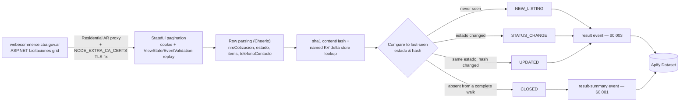

<div align="center">

# Cordoba Argentina Licitaciones - Tender Delta API

**A Cordoba, Argentina government procurement (compras públicas) monitor that turns a stateful, session-bound tenders portal into a clean, delta-aware public tenders dataset.**

[](https://apify.com)
[](https://apify.com/stefano_seggio/cordoba-compras-monitor)
[](https://www.typescriptlang.org/)
[](https://github.com/stefanoseggio/cordoba-compras-monitor/blob/main/LICENSE)

[](https://apify.com/stefano_seggio/cordoba-compras-monitor)

Console reference (owner): [console.apify.com/actors/q9jhMgJRSGjyNbXKA](https://console.apify.com/actors/q9jhMgJRSGjyNbXKA)

</div>

---

## What it does

Checking the Province of Córdoba's official *compras públicas* portal by hand means clicking through a paginated, stateful ASP.NET grid and re-reading every row yourself to notice what changed. **Cordoba Argentina Licitaciones - Tender Delta API** does that walk programmatically and hands back a structured public tenders dataset: tender number (`nroCotizacion`), contract type, issuing organism, jurisdiction, publication and closing dates, status (`estado`), per-item reference budget, and contact phone — one record per active licitación, already parsed from the source's own listing fetch.

Where this actor earns its keep as a **public tenders API alternative** for Córdoba is delta mode. With `onlyNew` enabled, it persists which tenders it has already seen — and their last-known status and a content fingerprint — in a key-value store that survives between scheduled runs, and on every subsequent run reports only what actually changed: a brand-new listing, a status change, an amendment (a deadline extension, a revised budget), or a closure. That is the difference between a one-off scrape and a Córdoba government procurement monitor a contractor, gestor, or market-research team can put on a schedule and trust to flag changes on its own.

The scope is deliberately exact: this actor covers the active *Licitaciones* register published by `webecommerce.cba.gov.ar`, nothing broader and nothing historical. Awarded or archived tenders are out of scope, by design, because the source itself does not expose them through this portal.

## Who uses this

- **Contractors and suppliers bidding on Córdoba public works and services** — pull the active register and use `tipoContratacion` and `servicioAdministrativo` on each record to spot the tenders that match what they sell and who's buying, with `prorroga` and `STATUS_CHANGE` flagging a tracked deadline extension without refreshing the portal.
- **Market-entry research teams evaluating the Córdoba public sector** — a full run (`onlyNew: false`) surfaces which agencies are actively procuring, and at what reference budget, via `servicioAdministrativo`, `jurisdiccion`, and `items[].presupuestoOficial`.
- **Procurement consultants and *gestores* tracking several clients' tenders at once** — a scheduled run with `onlyNew: true` returns only `NEW_LISTING`, `STATUS_CHANGE`, `UPDATED`, or `CLOSED` across every tracked `nroCotizacion`, instead of manually re-checking each client's tenders one by one.

## How it works



## Features

| Feature | Description |
| --- | --- |
| **Delta mode (`onlyNew`)** | Persists seen tender ids, their `estado`, and a content fingerprint in a named key-value store across scheduled runs; returns only what changed instead of the full register every time. |
| **Event classification** | Every delivered record is tagged `NEW_LISTING`, `STATUS_CHANGE`, `UPDATED`, or `CLOSED` (`eventTypes` narrows which of these delta mode delivers). |
| **Stateful ASP.NET pagination handled correctly** | Replicates the portal's postback/ViewState grid exactly as a real browser would, including its 11-slot sliding pager window, rather than treating it as a simple paged URL. |
| **Mid-run dedup against live inserts** | Every walked row is deduplicated by `nroCotizacion`, so a tender published while a multi-page walk is already in progress can't produce duplicate records. |
| **Residential Argentina proxy, defaulted** | The source blocks non-residential, non-Argentina traffic at the network level; the actor defaults to Residential + AR proxy even if `proxyConfiguration` is omitted entirely. |
| **Recency filter (`dateRange`)** | Optionally restricts results to tenders published in the last `24h`, `7d`, or `30d`, independent of delta mode. |
| **Inline line-item extraction** | Each tender's items (`renglon`, quantity, reference price, official budget) are extracted from the listing fetch itself — no per-tender follow-up request. |

## Input reference

| Field | Type | Default | Notes |
| --- | --- | --- | --- |
| `maxItems` | integer | `200` | Hard cap on active tenders returned this run. |
| `onlyNew` | boolean | `false` | Enables delta mode; recommended for recurring monitoring, off for a one-off full extraction. |
| `eventTypes` | array | all four | Which of `NEW_LISTING` / `STATUS_CHANGE` / `UPDATED` / `CLOSED` to deliver when `onlyNew` is on. |
| `dateRange` | string | *(none)* | Restrict to `fechaInicio` within `24h`, `7d`, or `30d`. |
| `proxyConfiguration` | object | Residential + AR | Required by the source; defaulted even if omitted. |

## Quick start

Run it directly with the [Apify CLI](https://docs.apify.com/cli) using a realistic input for recurring monitoring:

```bash
apify call cordoba-compras-monitor --input '{
  "maxItems": 200,
  "onlyNew": true,
  "eventTypes": ["NEW_LISTING", "STATUS_CHANGE", "UPDATED", "CLOSED"],
  "dateRange": "7d",
  "proxyConfiguration": {
    "useApifyProxy": true,
    "apifyProxyGroups": ["RESIDENTIAL"],
    "apifyProxyCountry": "AR"
  }
}'
```

Each dataset item looks like this (real field values, from a tender fetched during development):

```json
{
  "nroCotizacion": "2026/000091",
  "tipoContratacion": "Licitación - Soporte Digital",
  "servicioAdministrativo": "Agencia Córdoba De Inversión Y Financiamiento",
  "estado": "EN PROCESO",
  "event_type": "NEW_LISTING",
  "contentHash": "23092e21aec453265045c95e1a122288f48be84c"
}
```

## Reliability

- **Retries with backoff.** Every request — the initial GET and each pagination POST — retries up to 4 times with exponential backoff before the run gives up and returns what it has gathered so far.
- **TLS chain fixed explicitly.** The source's server sends only its leaf certificate, not the required intermediate; the actor supplies the missing intermediate/root via `NODE_EXTRA_CA_CERTS`, additively extending Node's trust store.
- **Delta state persisted safely.** A tender is only marked "seen" once it is actually pushed to the dataset this run, so one held back by `maxItems` stays correctly eligible for detection next run rather than silently dropping out of tracking.
- **`CLOSED` is only ever reported against a complete walk.** A run truncated by `maxItems` skips (and logs) closure detection rather than guessing that a missing tender has closed.
- **Deduplicates against live inserts.** New tenders can be published mid-walk, shifting later rows into duplicate positions across consecutive page fetches; every walked row is deduplicated by `nroCotizacion` so a mid-run insert can't produce duplicate dataset records.

## Instant Terminal Run (cURL)

Runs synchronously and returns the resulting dataset items directly in the response - no polling needed. Get your token from [console.apify.com/settings/integrations](https://console.apify.com/settings/integrations).

```bash
curl -X POST "https://api.apify.com/v2/acts/q9jhMgJRSGjyNbXKA/run-sync-get-dataset-items?token=<YOUR_API_TOKEN>" \
  -H "Content-Type: application/json" \
  -d '{
  "maxItems": 50,
  "onlyNew": true
}'
```

## Sample Extracted Dataset (JSON)

One real record from this Actor's own dataset, matching `.actor/dataset_schema.json`:

```json
{
  "nroCotizacion": "2026/000091",
  "tipoContratacion": "Licitacion Publica",
  "servicioAdministrativo": "Ministerio de Infraestructura",
  "jurisdiccion": "Gobierno de la Provincia de Cordoba",
  "fechaInicio": "10/09/2026 09:00",
  "fechaFinalizacion": "25/09/2026 12:00",
  "estado": "Publicada",
  "prorroga": false,
  "items": [
    {
      "renglon": "1",
      "cantidad": "500",
      "precioReferencia": "12.500,00",
      "presupuestoOficial": "6.250.000,00"
    }
  ],
  "telefonoContacto": "0351-4341300",
  "record_id": "2026/000091",
  "event_type": "NEW_LISTING",
  "previousEstado": null,
  "scraped_at": "2026-09-15T14:05:33.000Z",
  "is_new": true,
  "contentHash": "3a8f1e6c9b2d4507a1c8e3f6b9d2a5c8e1f4b7d0",
  "source_url": "https://compraspublicas.cba.gov.ar/"
}
```

## Pricing (Pay-Per-Event)

Pay per event, platform usage included — there is no separate compute charge on top:

| Event | Price | Charged when |
| --- | --- | --- |
| `result` | $0.003 per record | A tender is delivered as `NEW_LISTING`, `STATUS_CHANGE`, or `UPDATED` — full tender content. |
| `result-summary` | $0.001 per record | A tender is delivered as `CLOSED` — a derived absence signal, nothing fresh to fetch. |
| Actor start | $0.00005 | Once per run, regardless of how many tenders are returned. |

Recurring monitoring with `onlyNew: true` costs less per run by construction: it only ever delivers what actually changed since the last run, instead of billing `result` for every unchanged tender in the register every time.

## Why not just scrape it yourself

- **Zero infrastructure.** No container to keep patched, no headless-browser runtime to maintain — the actor runs on Apify's platform on your own schedule.
- **No proxy or session babysitting.** The source blocks non-residential, non-Argentina IPs outright and serves an incomplete TLS chain; both are already handled (Residential+AR proxy, `NODE_EXTRA_CA_CERTS`) so you don't debug `ConnectTimeoutError`s or certificate failures yourself.
- **The stateful postback flow is already solved.** This portal's pagination is a ViewState/EventValidation ASP.NET grid, not a paged URL — replicating that form state correctly, including the sliding pager window, is exactly the kind of brittle, easy-to-get-subtly-wrong logic this actor absorbs.
- **Built-in delta detection.** Change tracking (new / status-changed / amended / closed) is maintained for you in a persisted key-value store between runs — you get a diff, not a list to diff yourself.

## Known limitations

- **No stable per-tender URL.** This ASP.NET portal has no plain per-tender deep link — every "Ver Detalles" control is a session/ViewState-bound postback, not a URL — so `source_url` points at the general listing page rather than the specific record.
- **`CLOSED` requires a complete walk.** If `maxItems` cuts a run's page walk short, a previously-tracked tender missing from that partial fetch might simply be past where the walk stopped, not actually closed — so `CLOSED` detection is skipped on a truncated run rather than guessed.
- **Delta mode is a post-filter, not a pagination shortcut.** Córdoba's listing is not reliably sorted newest-first end to end, so `onlyNew` still walks the full register up to `maxItems` before filtering, rather than risking a missed tender by stopping early.
- **`dateRange` reflects the source's own declared publication date**, not an independently verified first-seen timestamp.
- **No contractual SLA.** This is an independently developed and maintained actor; bug reports and feature requests go through the Apify Store issue tracker and are typically triaged within about 48 hours.

---

<div align="center">

Part of **Delta Registry** — pay-per-event regulatory & compliance data infrastructure for public procurement and disclosure sources across Latin America.

For professional inquiries and enterprise licensing: [LinkedIn](https://www.linkedin.com/in/stefanoseggio-deltaregistry) · Browse the rest of the fleet: [github.com/stefanoseggio](https://github.com/stefanoseggio)

</div>
